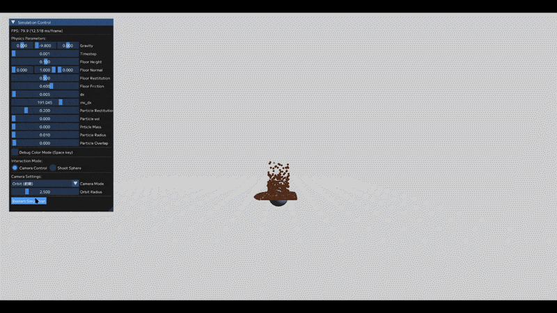
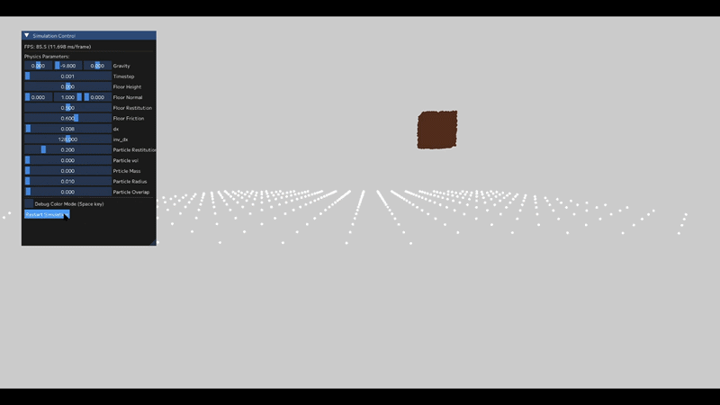

# MPM Simulation using 3D Texture Grid (OpenGL / Compute Shader)

GPU上で動作するMPM（Material Point Method）による土砂シミュレーション。  
従来のグリッド構造を**3Dテクスチャで代替**することで、データアクセスと並列処理の効率化を実現しています。

---

## ■ デモ

※ 粒子の落下・堆積挙動、および弾発射モードによる動的なシミュレーション

---

## ■ 概要

本プロジェクトは、粒子（状態保持）と格子（力学計算）を組み合わせた物理シミュレーション手法「MPM」を、OpenGLのコンピュートシェーダーで実装したものです。

最大の特徴は、格子構造に**3Dテクスチャ**を採用している点にあります。これにより、空間座標をそのままインデックスとして利用でき、従来の配列や木構造で必要だった複雑な近傍探索処理を排除しました。

---

## ■ 主な機能（Features）

本システムは、MPMを用いて土砂などの粉粒体の挙動をリアルタイムに計算・可視化します。
(※最新の追加した機能については"NEW"とつけています。)

 - **リアルタイムMPM演算**: GPU（Compute Shader）による高速な物理演算。
 - **3Dテクスチャ・グリッド**: imageLoad/Store を用いた高速な格子データアクセス。
 - **高度な物理モデル**: 土砂の崩落・堆積を表現する塑性変形・硬化モデルの実装。
 - **NEW: シミュレート空間管理システム**: SDF（符号付き距離関数）による当たり判定導入に向けた、オブジェクトの集中管理機構。
 - **NEW: 弾発射モード**: 任意のタイミングで粒子を射出し、衝突や堆積の挙動を検証可能。
 - **NEW: 視認性の向上**: 粒子の状態（弾性・塑性）に加え、特定の粒子への色割り当て（灰色）を追加。

---

## ■ パフォーマンス（Performance）

3Dテクスチャによるグリッド管理とメモリアクセスの最適化により、リアルタイム環境で以下のパフォーマンスを達成しています。

 - **約 10,000 粒子** : ~100 fps
 - **約 100,000 粒子** : ~19 fps

※ 現時点でのシステムであり、陰影計算、動的物体との当たり判定を行っていない **計算部分のみ** での性能
### ■ 計算部分のみのデモ
※ 粒子の落下・堆積挙動のシミュレーション

---

## ■ 技術的ポイント（Technical Highlights）

本プロジェクトの最大の焦点は、従来の手法における計算コストと実装の複雑さを、GPUネイティブなアプローチで解決した点にあります。

### 1. 空間管理とオブジェクト制御
複雑な形状との当たり判定を効率化するため、シミュレート空間内で障害物や弾を管理する仕組みを構築しました。

 - Meshクラス: EBO/VBOを保持し、シミュレーション空間内の障害物を描画・管理。
 - Cameraクラス: ビュー・プロジェクション行列を常に監視し、自由な視点移動を実現。

### 2. GPUメモリアクセスの最適化
C++（GLM）とGLSL間のメモリアライメント不一致を解決するため、データを16バイト境界（`std140`/`std430`）で厳密に設計し、安定したデータ転送を行っています。

### 3. 並列処理における競合制御
P2G（粒子→格子）ステップでの同時書き込みを、CAS（Compare-And-Swap）ループによるAtomic加算で解決しています。

---

## ■ ドキュメント

詳細な設計・実装については以下を参照：

- [Architecture](docs/architecture.md) : ソースコードの配置とシステムフロー
- [Implementation Details](docs/implementation.md) : 3Dテクスチャグリッドと計算ロジック
- [Issues and Fixes](docs/issues_and_fixes.md) : 開発中のバグ修正と改善の記録

---

## ■ 実行環境

- OpenGL 4.3 以上(Compute Shader必須)
- GLEW / GLFW
- GPU対応環境

---
