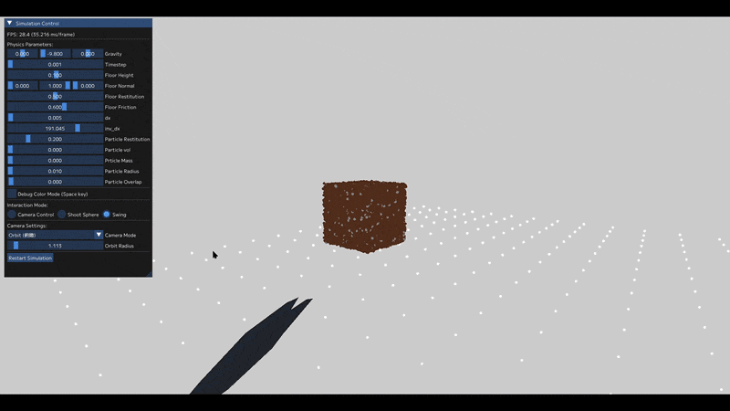

# MPM Sand Simulation with Interactive SDF Collisions (OpenGL / Compute Shader)

GPU上で動作するMPM（Material Point Method）による粉粒体シミュレーション。  
従来のグリッド構造を**3Dテクスチャで代替**することで、データアクセスと並列処理の効率化を実現しています。

---

## ■ デモ

※ 粒子の落下・堆積挙動、および弾発射モード（SDFオブジェクトの射出）、スイング操作による動的なシミュレーション

---

## ■ 概要

本プロジェクトは、粒子（状態保持）と格子（力学計算）を組み合わせた物理シミュレーション手法「MPM」を、OpenGLのコンピュートシェーダーで実装したものです。

最大の特徴は、格子構造に**3Dテクスチャ**を採用している点にあります。これにより、空間座標をそのままインデックスとして利用でき、従来の配列や木構造で必要だった複雑な近傍探索処理を排除しました。

さらに、SDF（符号付き距離関数）ベースの空間管理システムを統合することで、数万の粒子と複雑な3D形状がリアルタイムに相互作用する環境を構築しています。

---

## ■ 主な機能（Features）

本システムは、MPMを用いて土砂などの粉粒体の挙動をリアルタイムに計算・可視化します。
(※最新の追加した機能については"NEW"とつけています。)

 - **リアルタイムMPM演算**: GPU（Compute Shader）による並列物理演算。
 - **3Dテクスチャ・グリッド**: `imageLoad/Store` を用いた高速かつO(1)の格子データアクセス。
 - **高度な物理モデル**: 土砂の崩落・堆積を表現する塑性変形・硬化モデルの実装。
 - **【NEW】SDFによるオブジェクト管理**: 外部モデル（OBJ等）からSDFテクスチャを生成し、シミュレーション空間内に複雑な障害物として配置・接触判定が可能。
 - **【NEW】インタラクティブな操作系 (Shoot & Swing)**: カメラの逆行列レイキャストを用いて、SDFインスタンスを任意の方向へ発射（Shoot）したり、マウスドラッグからキネマティクス軌道を計算して振り下ろす（Swing）直感的な操作を実装。
 - **【NEW】クリーンアーキテクチャ (MVC)**: 司令塔となる `main.cpp` から生OpenGL関数や複雑な計算を排除し、Model(物理演算)、View(描画)、Controller(入力・操作) を完全に分離したモダンなクラス設計を採用。
 - **視認性の向上**: 粒子の状態（弾性・塑性）に応じたカラーリングに加え、材料の違い（砂・石）を判別する描画システム。
---

## ■ パフォーマンス（Performance）

3Dテクスチャによるグリッド管理と、SSBO（Shader Storage Buffer Object）のアライメント最適化により、統合GPU（内蔵グラフィックス）環境下であってもリアルタイム動作を実現しています。

**【計測環境】**

* CPU: 13th Gen Intel(R) Core(TM) i7-13620H
* GPU: Intel(R) UHD Graphics (※使用率 ~96%)
*(※NVIDIA GeForce RTX 4060 Laptop搭載機ですが、検証のためあえて統合GPU側で計測)*

**【計測結果】**

* **約 10,000 粒子** : ~85 fps 安定
* **約 100,000 粒子** : ~18 fps 安定

*(※現時点でのシステムであり、SDFを用いた動的物体との当たり判定を含む計算＋描画の統合パフォーマンスです)*

### ■ 初期計算部分のみのデモ

※ 粒子の落下・堆積挙動の基本シミュレーション

 - **約 10,000 粒子** : ~100 fps(フレッシュレート上限張り付き)
 - **約 100,000 粒子** : ~19 fps

※ 初期のシステムであり、陰影計算、動的物体との当たり判定を行っていない **計算部分のみ** での性能

---

## ■ 技術的ポイント（Technical Highlights）

本プロジェクトの最大の焦点は、従来の手法における計算コストと実装の複雑さを、GPUネイティブなアプローチで解決した点にあります。

### 1. 空間管理とSDFオブジェクト制御

外部から読み込んだメッシュデータを事前計算でSDFテクスチャ化し（リソース）、空間内で動的に姿勢を変えるオブジェクト（インスタンス）として分離管理しています。これにより、複雑な形状との高速な当たり判定（ペナルティ法）を並列処理内で実現しました。

### 2. GPUメモリアクセスの最適化

C++（GLM）とGLSL間のメモリアライメント不一致を解決するため、データを16バイト境界（`std140`/`std430`）で厳密に設計し、安定かつ高速なデータ転送を行っています。

### 3. 並列処理における競合制御

P2G（粒子→格子）ステップでの複数粒子からの同時書き込みを、CAS（Compare-And-Swap）ループによるAtomic加算で解決しています。

---

## ■ ドキュメント

詳細な設計・実装については以下を参照：

- [Architecture](docs/architecture.md) : ソースコードの配置、クラス構成とシステムフロー
- [Implementation Details](docs/implementation.md) : 3Dテクスチャグリッドと計算ロジック
- [Issues and Fixes](docs/issues_and_fixes.md) : 開発中のバグ修正と改善の記録

---

## ■ 実行環境

- OpenGL 4.3 以上(Compute Shader必須)
- GLEW / GLFW / GLM
- GPU対応環境(統合GPUでも動作可能)

---