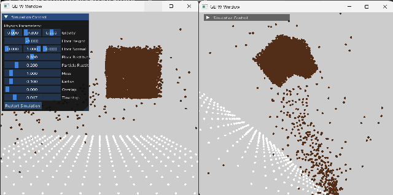
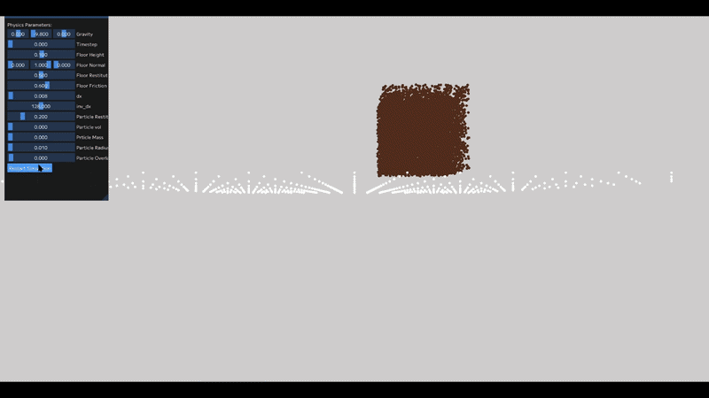
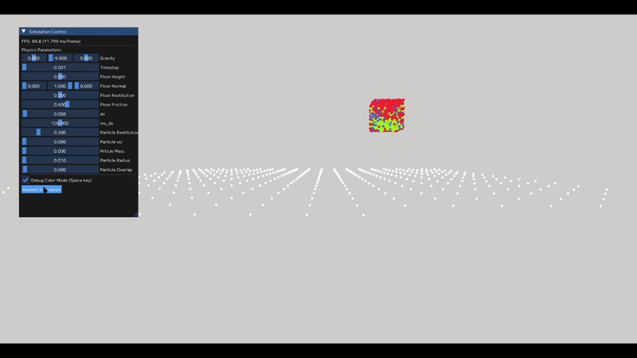
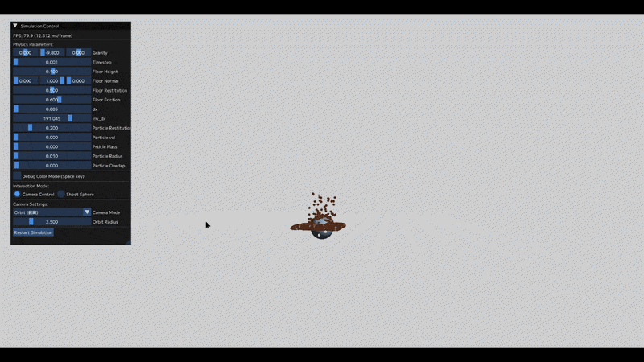

# バグと改善の記録（Issues and Fixes）

本プロジェクトの開発過程において発生した主要な問題と、その原因分析および修正内容を記録する。

---

## 1. C++ と GLSL のアライメント問題

### ■ 問題

コンピュートシェーダーを用いたMPMシミュレーションを実装したが、  
コンパイルエラーは発生しないにも関わらず、以下の異常が発生した：

- 粒子が全く動かない
- 初期配置（立方体）が崩れ、粒子が不自然に散乱する

※ 該当の挙動 : 
動かず散乱する粒子



---

### ■ 原因仮説

シミュレーションの最終段階で粒子に固定速度を与えても動作しなかったことから、  
**GPUとのデータ転送（SSBO）に問題がある可能性**を疑った。

特に以下に着目した：

- C++（GLM）とGLSLでのデータ構造の違い
- メモリアライメントの不一致

---

### ■ 検証

以下の確認を行った：

- 粒子に強制的に一定速度を与える処理を追加
- それでも粒子が移動しないことを確認

→ 計算ではなく、**データが正しく渡っていない可能性が高い**と判断

さらに、構造体のサイズとメモリ配置を調査した結果：

- GLSLでは `vec3` は16バイト単位でアラインメントされる
- C++（GLM）では `vec3` は12バイト

→ 構造体のレイアウトが一致していないことを確認

---

### ■ 修正

以下の対応を行った：

- `vec3` や `mat3` をそのまま使用するのをやめる
- すべてのデータを **16バイト境界に揃えるように再設計**
- 不足分は `padding` 用の変数で埋める

例：

```cpp
// イメージ
float x;		// 4バイト
float y;		// 4バイト
float z;		// 4バイト
float padding; 	// アライメント調整 (4バイト,ここで16バイト)
```

### ■ 結果
 -  粒子に固定速度を与えた際、正しく等速運動することを確認
 - データ転送の問題が解消された

---

## 1.1 スケール（精度）に関する仮説（未採用）
### ■ 仮説
テクスチャ内で値が 0〜1 に正規化されるため、
 - 小数点以下の精度が失われ
 - 値が0に丸められている可能性
を疑った。

---

### ■ 検証

以下の対応を実施：
 - 値を取り出す際にスケーリング（定数倍）
 - 書き戻す際に逆スケーリング

---

### ■ 結果
 - 数値が大きくなることで、float精度の問題が発生
 - むしろ情報が失われ、シミュレーションが停止

---

### ■ 結論
この仮説は誤りであり、
問題の本質はアライメント不一致であった。

---

## 2. 座標系の基準位置のずれ
### ■ 問題
アライメント問題を修正後、粒子は動作するようになったが、
 - 粒子が不自然に拡散する
 - 立方体の内側に張り付くような挙動を示す
という異常が発生した

※ 該当の挙動 : 
異常な挙動



--

### ■ 原因仮説

挙動の特徴から：
 - 力が爆発しているわけではない
 - 境界付近で特異な動きが発生している
→ 計算式そのものではなく、座標系のずれを疑った

特に：
 - グリッド計算における基準位置（base）
 - 粒子位置のローカル座標（fx）
の関係に着目した

---

### ■ 検証
以下の2パターンを比較 : 
```
// 修正前
vec3 fx = x * inv_dx;
ivec3 base = ivec3(floor(fx - 0.5));
```

```
// 修正後
vec3 fx = x * inv_dx - 0.5;
ivec3 base = ivec3(floor(fx));
```

また、重み計算において
```
vec3 weight_dist = fx - vec3(base);
```
において、fx の値が直接影響する点を確認

---

### ■ 修正
 - グリッドの基準位置と粒子座標の定義を統一
 - fx と base の関係を修正

---

### ■ 結果
 - 粒子のねじれや異常な引力が解消
 - 重力に従った自然な落下挙動を確認
 - シミュレーションが正常に動作

---

## 3. デバッグ可視化による検証

塑性変形の挙動を確認するため、
粒子の状態を3種類に分類し、色分けして可視化を行った。

- 弾性状態：青
- 塑性状態：赤
- 遷移状態：緑



この可視化により、

- 想定通りに塑性判定が行われているか
- 空間的に不自然な分布がないか

を視覚的に確認できるようになった。

---

## 4. カメラ主導設計への移行とスクリーン座標の変換

### ■ 問題
「画面上のクリック位置に対して弾を発射する」という新機能を検討した際、既存の実装では以下の点が障害となった：

 - **モデル回転による制御**: 空間そのもの（Model行列）を回転させて視点を変えていたため、2Dのクリック座標を3Dのシミュレート空間へ逆投影する計算が極めて複雑であった。
 - **座標系の不一致**: カメラが固定で世界が回る設計では、直感的なレイキャスティング（視点からマウス方向への光線飛ばし）の実装が困難であった。
 
### ■ 修正とリファクタリング
2D情報を正確に3D空間へ落とし込むため、「モデルを回す」のではなく「カメラを動かす」設計への根本的な転換を行った。

 - **Cameraクラスの導入**: $View$ 行列と $Projection$ 行列を独立させ、カメラの $position$, $front$, $up$ ベクトルを管理する方式へ変更。
 - **Model行列の固定**: 各オブジェクトの $Model$ 行列を恒等行列（または配置のための固定値）として扱うことで、世界座標系とシミュレート空間を一致させた。
 - **座標変換の実装**:`Camera`クラスから得られる行列を用いることで、スクリーン座標からワールド座標への変換、およびクリック位置に応じた弾の発射ベクトル計算を簡潔に記述可能となった。



### ■ 結果

 - **機能実現**: クリック位置に対して正確に弾（粒子）を撃ち込む「弾発射モード」を実装。
 - **コードの簡素化**: $MVP$ 行列の算出ロジックが標準的な形式に整理され、保守性が向上。
 - **2つの操作モード（FPS / ORBIT）**: カメラ主導の設計にしたことで、従来の注視点回転（ORBIT）だけでなく、カメラ自身の向きを変える FPS モードの切り替えも容易に実現できるという「怪我の功名」的な副次的メリットが得られた。

---

## まとめ
本プロジェクトでは、以下の2点が主要な問題であった：
1. CPU-GPU間のメモリアライメント不一致
2. グリッド座標系の基準位置のずれ
いずれも「一見小さな差」であるが、
 - データ転送の破綻
 - 非物理的な力の発生
といった重大な問題を引き起こした。

これらの問題を段階的に切り分け、修正することで、最終的に安定したMPMシミュレーションを実現した。
